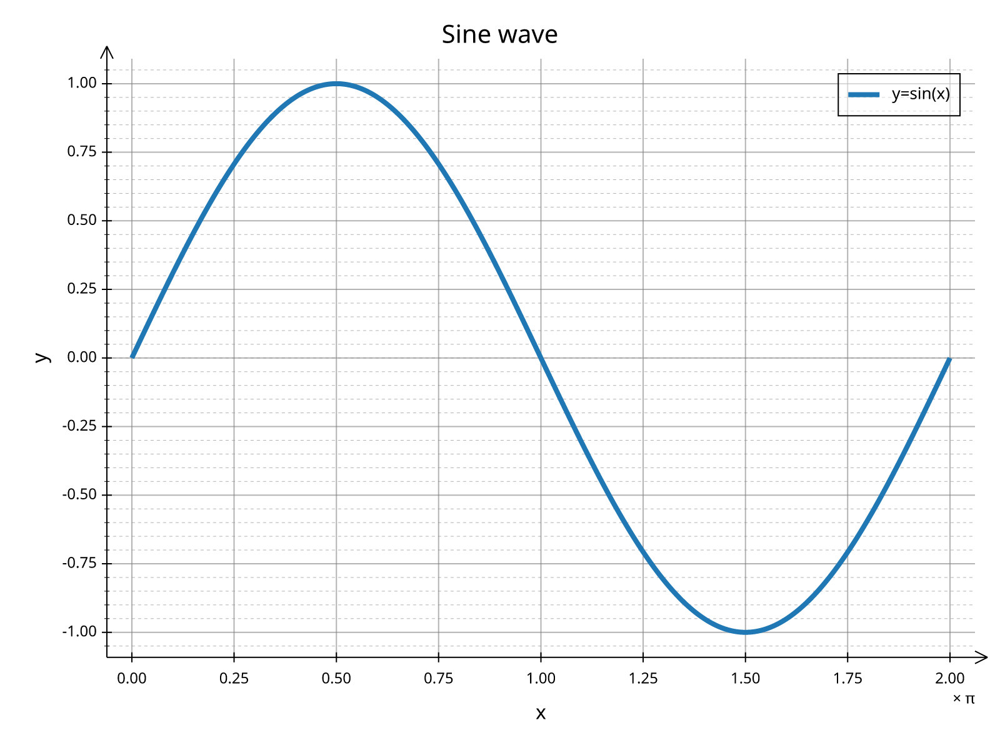
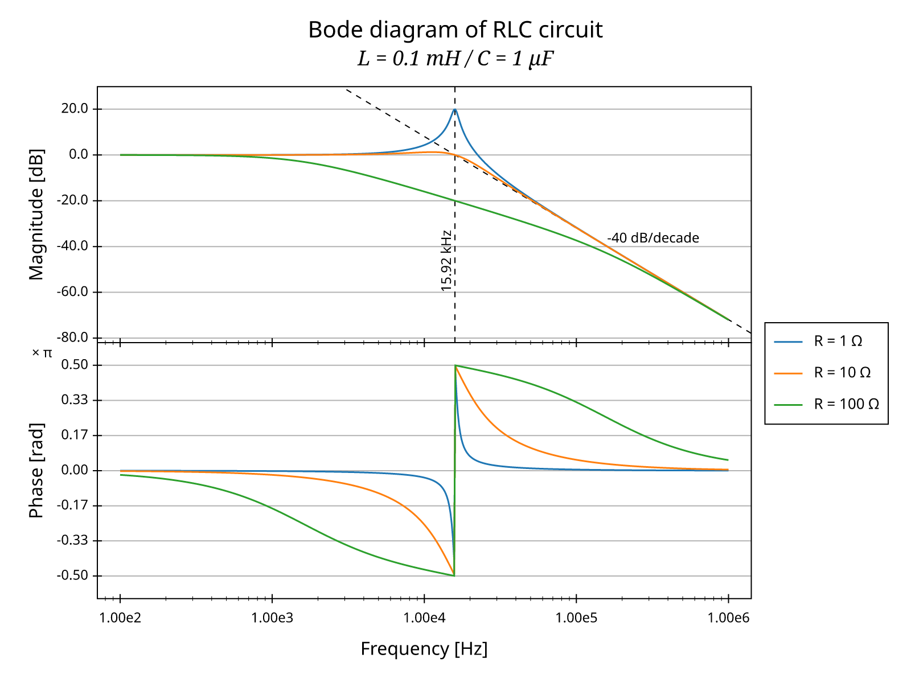
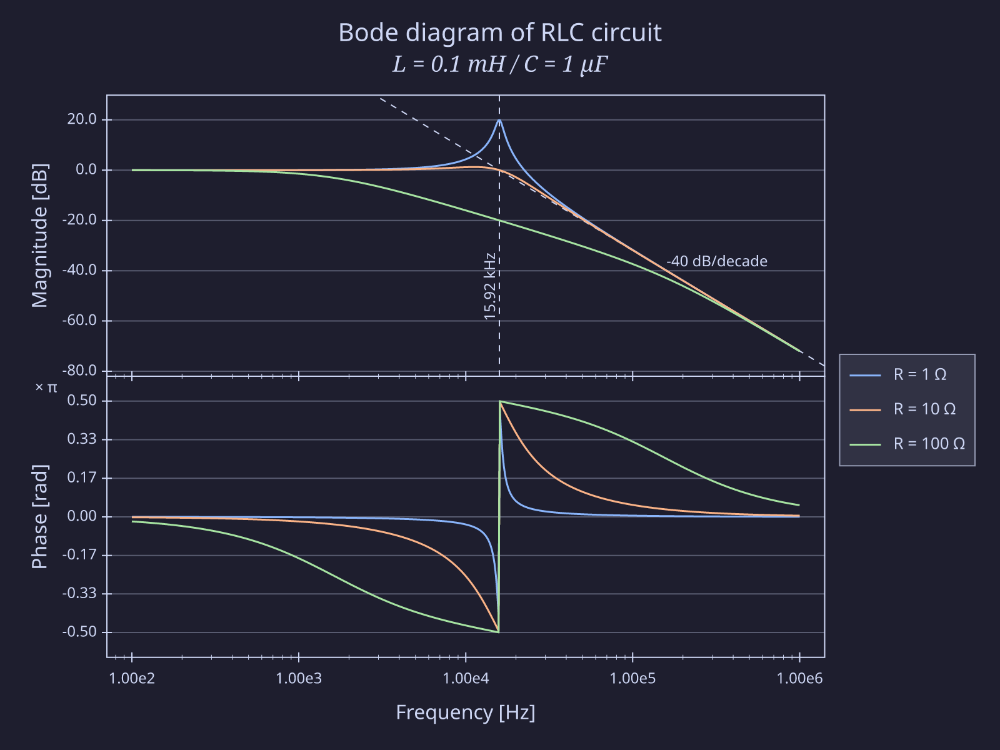
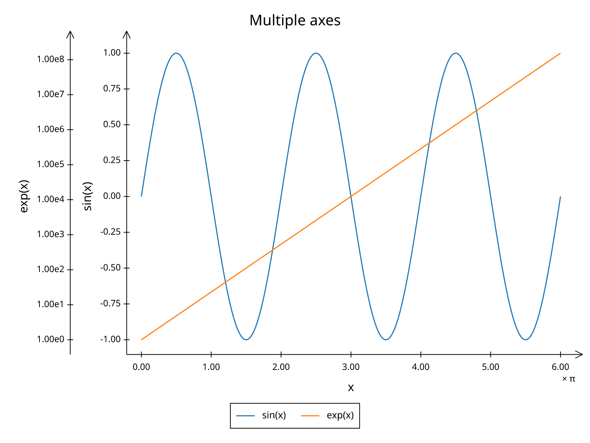
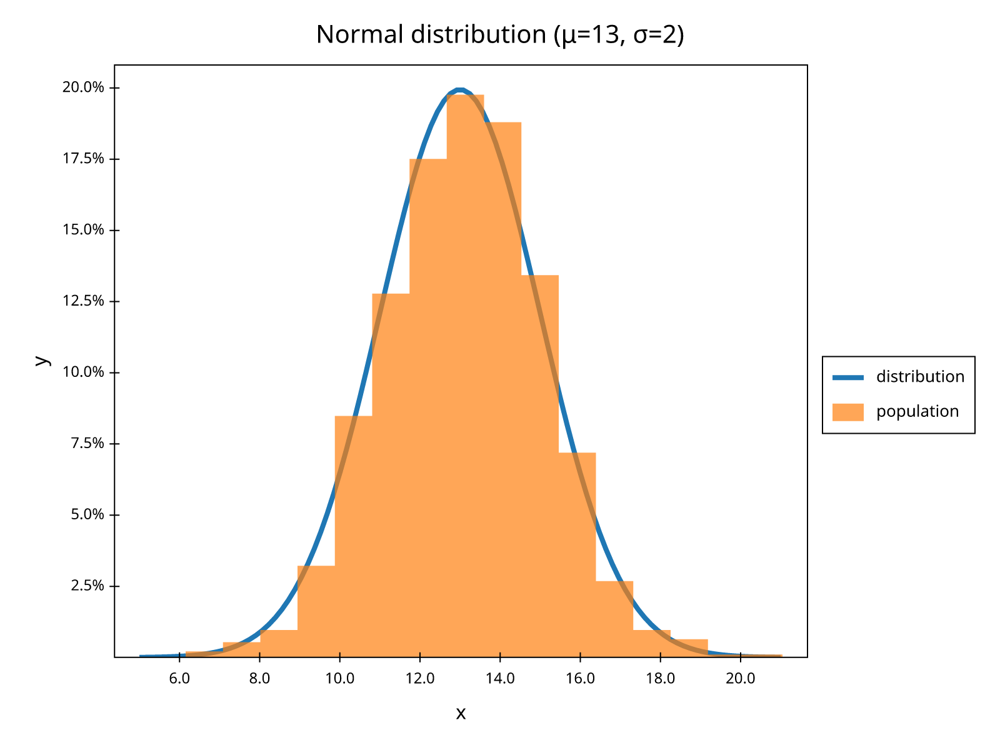
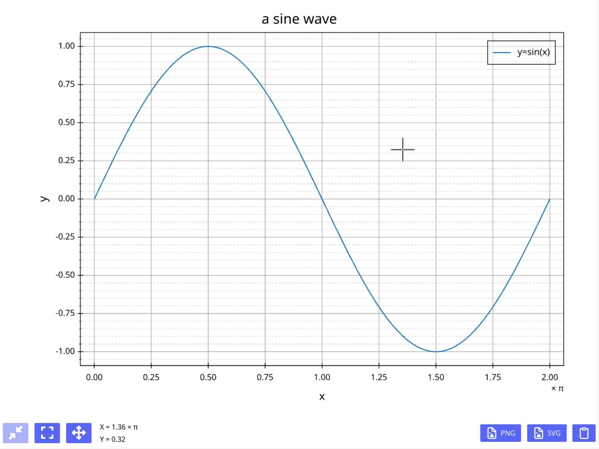

# plotive

_declarative plotting_. A simple data plotting library written in Rust.

[](https://opensource.org/licenses/MIT)

## Overview and features

Plotive decouples figure design from data and from rendering surfaces.

### Supported series types
 - XY line plots
 - Scatter plots
 - Histograms and bar plots

More will come. Don't hesitate to open an issue to request a feature!

### Modular architecture

 - **Declarative design** (`plotive::des`)
   - Design of figure is entirely declarative and decoupled from data and drawing primitives
   - Sensible defaults. Most types that populates design implement carefully crafted `Default` trait.
   - Figure units are decorrelated from pixel size for easy scaling
   - `.plotive` DSL language for concise figure description.
This DSL is still fairly incomplete, but all examples in the repo are working.

 - **Data sources** (`plotive::data`)
   - Flexible, column-friendly data source system
   - Support for CSV and [polars](https://pola.rs) is included

 - **Rendering surfaces** (`plotive::render` and separate crates)
   - `plotive-pxl`: Rasterized rendering (PNG, or pixels array)
   - `plotive-svg`: SVG rendering
   - `plotive-iced`: GUI rendering with [iced](https://iced.rs).


### Automatic Layout
 - All the layout is done consistently and automatically.<br />
 You can add multiple axes, multiple plots etc.
 Everything will be laid-out consistently, leaving enough space for axis ticks labels, legends etc.  Your code never need to calculate size of anything.

### Advanced typography
 - Automatic font look-up and text shaping
 - Rich text
 - Automatic right to left layout using unicode-bidirectional algorithm
 - vertical layout

### Themes
 - Change the theme of your figure with a single line of code (see the bode diagram hereunder)

### Annotations
 - Annotate your figures, with labels, infinite lines, markers etc.
 - Annotations are placed using data space coordinates

### GUI integration and real-time rendering
 - The crate `plotive-iced` provides a `Figure` widget.<br />
Thanks to separation of data from design, redraws of the same figure with different data
is very efficient and compatible with real-time rendering, up to hundreds of redraws per second.


## Gallery







(a few more in the gallery folder)

## Get started

Add `plotive` to your project, as well as one of the surface backend crates.<br />
(here `plotive-iced`, a GUI crate for [iced.rs](https://iced.rs))
```
cargo add plotive
cargo add plotive-iced
```

To create a figure, you start by declaring its design with the `des` module, referencing data that will come later.
The design structure is purely declarative, own all its data and very lightweight:

```rust
use plotive::des;

let x_axis = des::Axis::new()
    .with_title("x".into())
    .with_ticks(
        des::axis::Ticks::new()
            .with_locator(des::axis::ticks::PiMultipleLocator::default().into()),
    )
    .with_grid(Default::default());

let y_axis = des::Axis::new()
    .with_title("y".into())
    .with_ticks(Default::default())
    .with_grid(Default::default())
    .with_minor_ticks(Default::default())
    .with_minor_grid(Default::default());

let series = des::series::Line::new(des::data_src_ref("x"), des::data_src_ref("y"))
    .with_name("y=sin(x)")
    .into();

let plot = des::Plot::new(vec![series])
    .with_x_axis(x_axis)
    .with_y_axis(y_axis)
    .with_legend(des::plot::LegendPos::InTopRight.into());

let fig = des::Figure::new(plot.into()).with_title("a sine wave".into());
```

Then (or before) you can prepare the data to be plotted with any structure implementing the column-friendly trait `plotive::data::Source`.

```rust
use plotive::data;

let x: Vec<f64> = (0..=360).map(|t| t as f64 * PI / 180.0).collect();
let y = x.iter().map(|x| x.sin()).collect();

let data_source = data::TableSource::new()
    .with_f64_column("x", x)
    .with_f64_column("y", y);
```

Everything is ready. You can use any of the crate providing implementation for `plotive::render::Surface` to either save to an image file, or show it in a GUI:

```rust
use plotive_iced::Show;

fig.show(Arc::new(data_source), Default::default()).unwrap();
```

During execution, the following window shows:



## Crate features

 - `data-csv`: enables `plotive::data::{csv, CsvParser}`
 - `data-polars`: enables `plotive::data::polars`<br />
   pulls in the `polars` dependency, which is a big beast.
 - `dsl`: enables the support for `.plotive` DSL.
 - `noto-mono`, `noto-sans`, `noto-sans-italic`, `noto-serif`, `noto-serif-italic`: bundles the corresponding fonts from Google in the final executable, and enables `plotive::bundled_font_db()`.<br />
  `noto-sans` is enabled by default
 - `time`: enables `plotive::time` module and support for time series, CSV date-time parsing etc.
 - `utils`: enables `plotive::utils`, that contains various utilities such as `linspace`, `logspace` etc.
